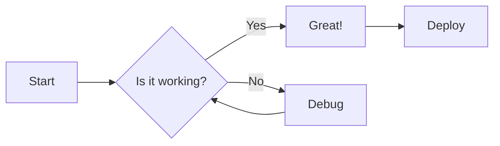

# Welcome to MkDocs Bifrost Template

A beautiful, feature-rich documentation template using Material for MkDocs with Bifrost styling.

## Quick Start

This template provides everything you need to create professional documentation sites with minimal setup.

### For Template Users

1. **Use this template** to create your own repository
2. **Edit `mkdocs.yaml`** to customize site settings
3. **Replace this page** (`docs/index.md`) with your own content
4. **Add your documentation** in the `docs/` directory
5. **Push to GitHub** and enable GitHub Pages

### Features at a Glance

=== "Navigation"

    - Tabbed navigation with sections
    - Instant page loading
    - Navigation tracking in URL
    - Back-to-top button
    - Expandable sections

=== "Search"

    - Full-text search
    - Search suggestions
    - Result highlighting
    - Shareable search URLs

=== "Content"

    - Syntax highlighted code blocks
    - Copy-to-clipboard for code
    - Admonitions (notes, warnings, tips)
    - Tabbed content blocks
    - Mermaid diagram support
    - Emoji support

=== "Theming"

    - Bifrost color schemes (teal, purple, pink, yellow)
    - Dark/light mode toggle
    - Responsive design
    - Custom branding

## Customization Guide

### Change the Color Scheme

Edit `mkdocs.yaml` line 25 to change the primary color:

```yaml
primary: &bifrost_theme teal  # Options: teal, purple, pink, yellow
```

The color is defined once and automatically applied to both light and dark modes.

### Add Pages

1. Create markdown files in the `docs/` directory
2. Update the `nav` section in `mkdocs.yaml`:

```yaml
nav:
  - Home: index.md
  - Getting Started: getting-started.md
  - User Guide:
      - Installation: guide/installation.md
      - Configuration: guide/configuration.md
```

### Use Admonitions

Create styled callout boxes:

!!! note "Did you know?"
    You can use different admonition types: `note`, `abstract`, `info`, `tip`, `success`, `question`, `warning`, `failure`, `danger`, `bug`, `example`, `quote`.

!!! tip "Pro Tip"
    Admonitions can be collapsible! Use `???` instead of `!!!`:
    
        ??? tip "Click to expand"
            Hidden content goes here!

??? example "Click to see a collapsible example"
    This content is hidden until the user clicks to expand it.

### Code Blocks with Syntax Highlighting

```python
def hello_world():
    """A simple Python function."""
    print("Hello, World!")
    return True

# Code blocks automatically get:
# - Syntax highlighting
# - Line numbers (optional)
# - Copy button
# - Language indicator
```

```bash
# Install dependencies
pip install -r requirements.txt

# Serve locally with live reload
mkdocs serve

# Build static site
mkdocs build
```

### Create Diagrams with Mermaid



## Example Content Structures

### Documentation Site

```
docs/
├── index.md              # Home page
├── getting-started.md    # Quick start guide
├── user-guide/
│   ├── installation.md
│   ├── configuration.md
│   └── usage.md
├── api/
│   ├── reference.md
│   └── examples.md
└── contributing.md       # Contribution guidelines
```

### Project Documentation

```
docs/
├── index.md              # Project overview
├── architecture/
│   ├── overview.md
│   ├── components.md
│   └── diagrams.md
├── guides/
│   ├── deployment.md
│   ├── operations.md
│   └── troubleshooting.md
└── reference/
    ├── api.md
    └── configuration.md
```

## Next Steps

1. **Replace this page** with your project's home page
2. **Create your documentation structure** in the `docs/` folder
3. **Update the navigation** in `mkdocs.yaml`
4. **Test locally** with `mkdocs serve`
5. **Deploy to GitHub Pages** by pushing to your repository

## Resources

- [MkDocs Documentation](https://www.mkdocs.org/)
- [Material for MkDocs](https://squidfunk.github.io/mkdocs-material/)
- [Material Extensions Reference](https://squidfunk.github.io/mkdocs-material/reference/)
- [Markdown Guide](https://www.markdownguide.org/)

## Need Help?

- Check the [Material for MkDocs documentation](https://squidfunk.github.io/mkdocs-material/)
- Review the `mkdocs.yaml` configuration comments
- Open an issue on GitHub

---

**Ready to get started?** Replace this content with your own and start building great documentation!
